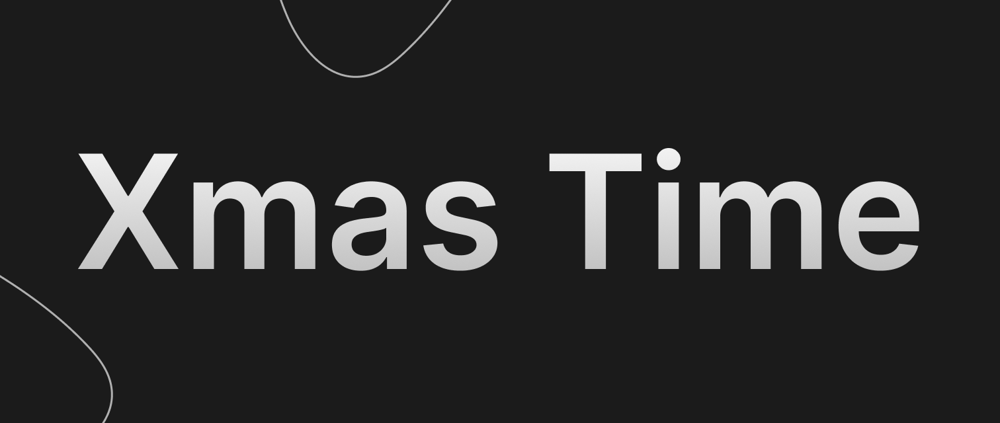
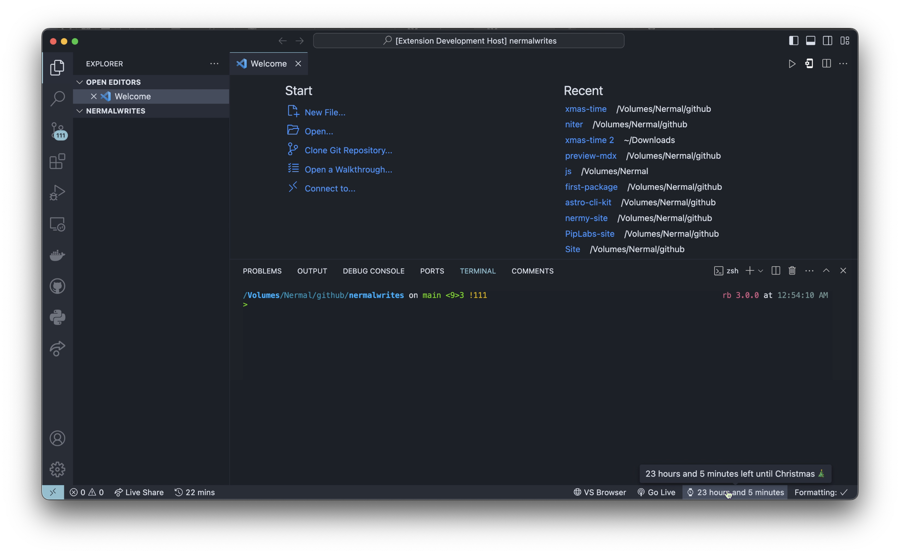

# Xmas Time (╯^□^)❄☃❄

**Xmas Time** is a fun Visual Studio Code extension that adds a Christmas countdown to your status bar, spreading holiday cheer!

## Features

- 🎄 Real-time countdown to Christmas in your status bar.
- 🎅 Festive icons to brighten your coding sessions.

## Installation

1. Open **Visual Studio Code**.
2. Go to the **Extensions** view (`Ctrl + Shift + X`).
3. Search for "**Xmas Time**" and click "**Install**."

## Usage

- The Christmas countdown will be displayed in the status bar once the extension is installed.
- Hover over to the countdown(status bar) to see the magic.
- Optionally, use the `Xmas Time: Run` command (`Ctrl + Shift + P` and type "Xmas Time: Run") to update the countdown manually.

> Tip: In many countries, Christmas is celebrated on the 24th of December. To change the date to the 24th, use `Ctrl` + `Shift` + `P` (Windows) or `Cmd` + `Shift` + `P` (Mac) in Visual Studio Code.

## Screenshots

## Contributors
1. [Devvali](https://github.com/DevVali/)
2. [Nermalcat69](https://github.com/nermalcat69/)

If you'd like to contribute to the development of Xmas Time, feel free to submit pull requests or open issues on [GitHub](https://github.com/DevVali/xmas-time).

## License

This extension is licensed under the [MIT License](LICENSE).

---

Happy Coding and Merry Christmas! 🎄✨
